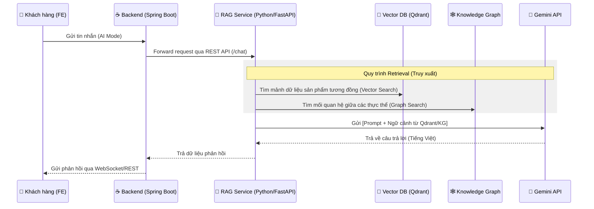

# 🧠 E-Fashion: Kiến trúc Tích hợp AI & Retrieval-Augmented Generation (RAG)

Tài liệu này mô tả chi tiết luồng hoạt động từ lúc người dùng gửi tin nhắn trên Giao diện (FE) cho đến khi nhận được phản hồi thông minh từ trợ lý AI (RAG).

## 1. Sơ đồ luồng tổng quát (Data Flow)

## 2. Các thành phần chính

### A. Backend (BE - Java Spring Boot)
*   **AiChatController**: Tiếp nhận yêu cầu từ người dùng.
*   **AiChatService**: Đóng vai trò là "người vận chuyển". Nó không trực tiếp xử lý ngôn ngữ mà sẽ gọi sang service RAG chuyên dụng.
*   **WebSocket**: Đảm bảo phản hồi từ AI được đẩy về FE theo thời gian thực (real-time).

### B. RAG Backend (Python FastAPI) - "Bộ não"
Đây là nơi xử lý logic phức tạp nhất, chia làm 2 giai đoạn:

#### 1. Giai đoạn Nạp dữ liệu (Ingestion)
*   **File nguồn**: `efashion_catalog.md` (Chứa toàn bộ thông tin sản phẩm).
*   **Parser (Docling)**: Đọc file và chia thành từng đoạn (Chunks) 1024 tokens mới giúp giữ nguyên ngữ cảnh "Tên + Giá".
*   **Deduplication**: Lọc bỏ các thông tin trùng lặp để tinh gọn kiến thức.
*   **Lưu trữ**: 
    *   **Qdrant**: Lưu tọa độ vector để tìm kiếm theo ý nghĩa.
    *   **LightRAG**: Xây dựng đồ thị liên kết tri thức.

#### 2. Giai đoạn Truy xuất (Retrieval)
*   **Vector Search**: Tìm nhanh các đoạn dữ liệu liên quan.
*   **Graph Search**: Tìm thêm các thông tin mở rộng (thông tin thương hiệu, phân loại).
*   **Reranker**: Chấm điểm lại các đoạn dữ liệu để chọn ra những thông tin tốt nhất.

### C. Large Language Model (Gemini)
*   Nhận yêu cầu kèm theo "tập tài liệu" đã được lọc sẵn.
*   Nhiệm vụ: Tổng hợp thông tin từ tài liệu và trả lời bằng phong cách chuyên nghiệp của shop.

## 3. Các thông số tối ưu hiện tại
*   **Chunk Size**: 1024 tokens.
*   **Prefetch Count**: 50.
*   **Top K**: 12.
*   **Min Relevance**: 0.1.

## 4. Tại sao hệ thống này thông minh hơn chatbot thường?
1.  **Không bị ảo tưởng (Hallucination)**: AI chỉ dựa trên Catalog thực tế.
2.  **Hiểu ngữ cảnh sâu**: Kết hợp giữa Vector Search (ý nghĩa) và Graph Search (quan hệ).
3.  **Khả năng tự học**: Cập nhật file Catalog là AI có kiến thức mới ngay lập tức.
